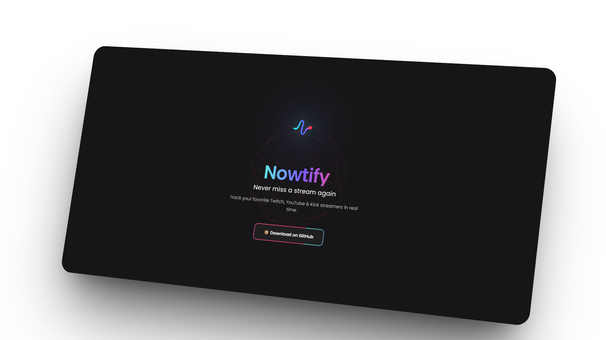

  
  
  <h1>🔔 Nowtify</h1>
  
<em>Never miss a live stream from your favorite creators</em>

  <!-- Header buttons -->
  

    
    
  

  <!-- Screenshot -->
  

    
  

   

---

## ⚡ Features

<table>
<tr>
<td>

### 🎨 Design

Modern and clean interface
Elegant Manrope font
Smooth animations
Responsive design
Native dark mode

</td>
<td>

### ⚙️ Technical

Chrome Extension Manifest V3
Twitch, YouTube & Kick APIs
Performant Service Worker
Native notifications
Secure local storage

</td>
<td>

### 🌟 Experience

Instant notifications
Multi-platform (Twitch, YouTube, Kick)
Customizable settings
Intuitive interface
Zero latency

</td>
</tr>
</table>

---

## 🧰 Tech Stack

  

---

## 💬 Feedback
If you enjoyed the project, leave a ⭐ or share it!
I’d love to hear your thoughts and ideas.

---

## 🤝 Contributing
Contributions are welcome!
Feel free to open a pull request or an issue to suggest improvements.

---

## 📜 License
This project is under the **[MIT license](LICENSE)** – free to use with attribution.

---

## 📈 Growth

> 📊 Follow the evolution of the project over time

<a href="https://star-history.com/#vestal2k/nowtify&Timeline">
  <picture>
  <source media="(prefers-color-scheme: dark)" srcset="https://api.star-history.com/svg?repos=vestal2k/nowtify&type=Timeline&theme=dark" />
  <source media="(prefers-color-scheme: light)" srcset="https://api.star-history.com/svg?repos=vestal2k/nowtify&type=Timeline" />
  
  </picture>
</a>

---

 

  

  🖤 Project developed by <a href="https://github.com/vestal2k">Vestal</a>

