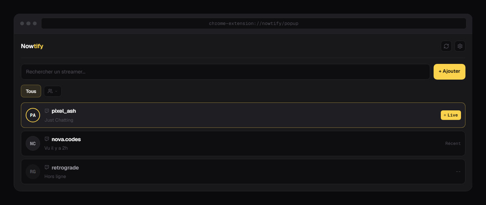

  
  <h1>Nowtify</h1>
  
<em>Never miss a stream again.</em>

  

    
    
  

  

    <a href="https://nowtify.qyrn.dev"><strong>nowtify.qyrn.dev</strong></a>
  

  

    
  

---

## What it does

Nowtify watches your favorite Twitch streamers in the background and sends a
native desktop notification when one of them goes live. It lives in your
Chrome toolbar and stays out of your way otherwise.

No account, no backend, no analytics. Everything stays on your machine.

## Features

- Desktop notification the moment a streamer goes live
- Toolbar badge showing how many streamers are currently live
- Live, recently live, and offline streamers, all in one popup
- Search with autocomplete to add streamers in a click
- Import an entire Twitch team at once, then filter your list by team
- Snooze notifications for a single streamer (1 hour, today, or until tomorrow)
- Upcoming stream schedule for offline streamers, pulled from Twitch
- Live thumbnail, category, and viewer count without leaving the popup
- History and local stats: streams caught, top streamer, top game
- Back up and restore your data as a single file
- Compact grid view for a denser list
- English and French, follows your browser's language automatically

## Installation

1. Download or clone this repository.
2. Open `chrome://extensions` in Chrome.
3. Turn on **Developer mode** in the top right corner.
4. Click **Load unpacked** and select the project folder.

That's it, Nowtify connects to Twitch on its own, no setup or API key needed.

## License

Released under the [MIT license](LICENSE). Free to use with attribution.

## Author

Developed by [qyrn](https://github.com/qyrn).

If you find Nowtify useful, you can support the project on
[Ko-fi](https://ko-fi.com/qyrnsec).
